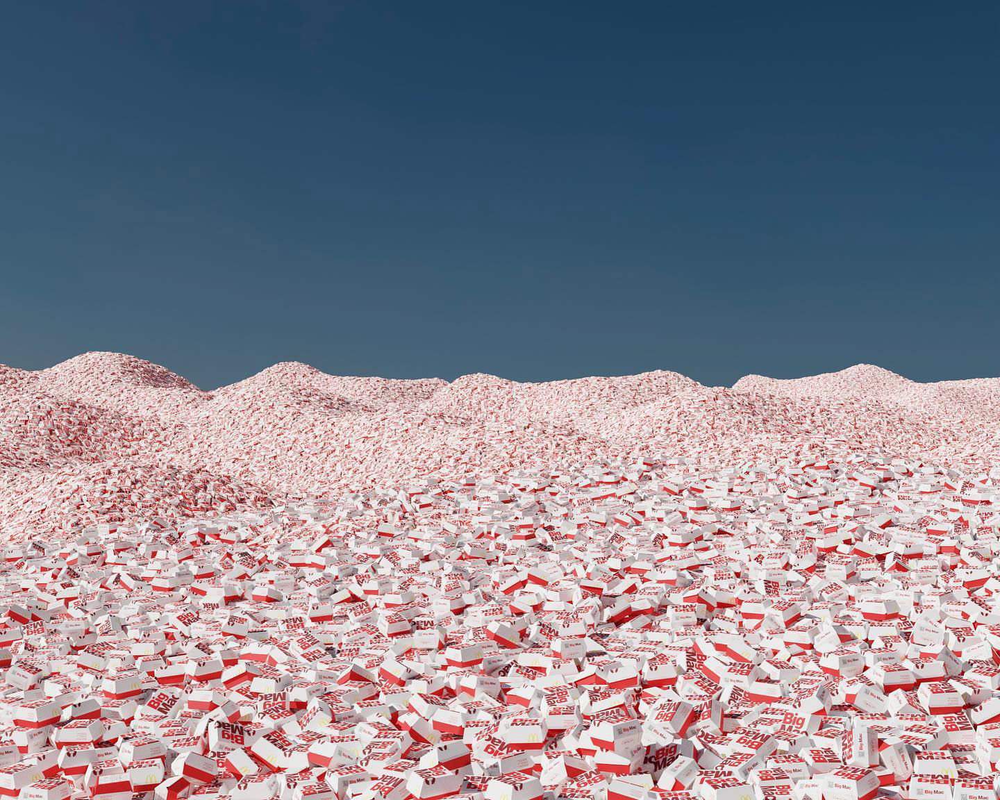
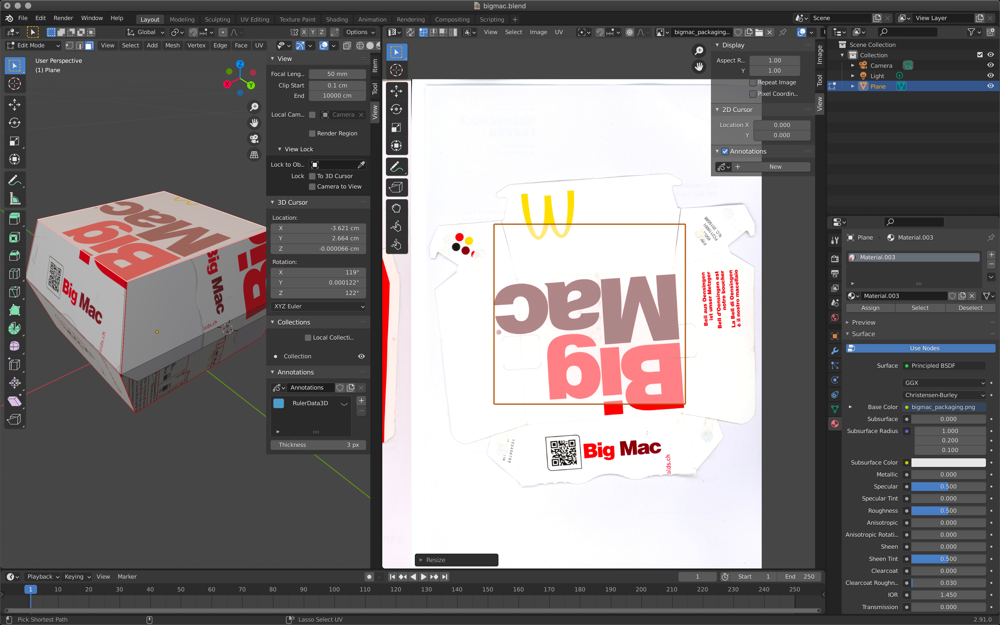

## Blender Experiments

These are some experiments with 3D modeling and rendering in Blender.

### Technique

I highly recommend checking out [Ian Hubert's YouTube channel](https://www.youtube.com/@IanHubert2) for his incredible technique of using photos as the base and modeling everything from those reference images. His approach to photo-realistic 3D environments is amazing.

