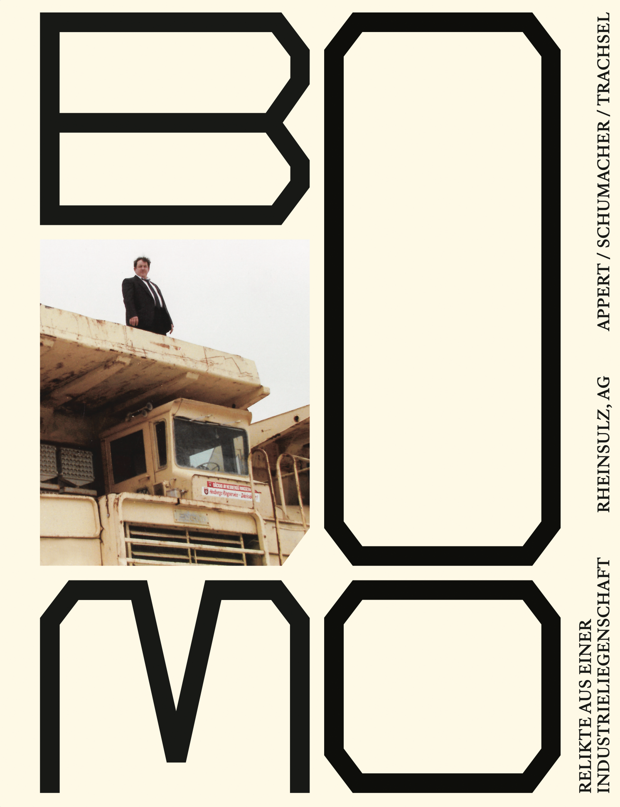

## BOOM
### Bachelor Project

A collaborative bachelor project exploring the industrial heritage of Rheinsulz near Laufenburg on the High Rhine. Working with Eveline Schumacher and Mario Trachsel, we documented an industrial site caught between railway tracks and the Rhine riverbank.

### The Site

Since 1960, five medium-sized companies experienced different economic booms, declines, and new beginnings on what is now the Astra Tech AG site. What remained were traces of the coming and going of the businesses that operated here.

### The Book

The end product was a book featuring fictionalized theatre-style dialogues written from interviews we conducted with people connected to the site. These conversations brought the industrial stories to life, creating a narrative bridge between past and present.

