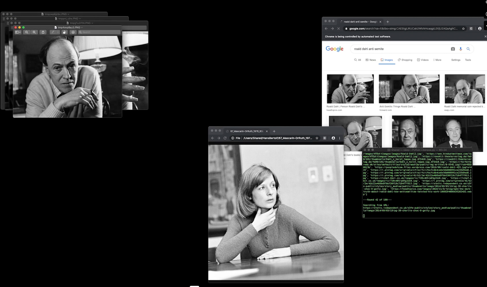
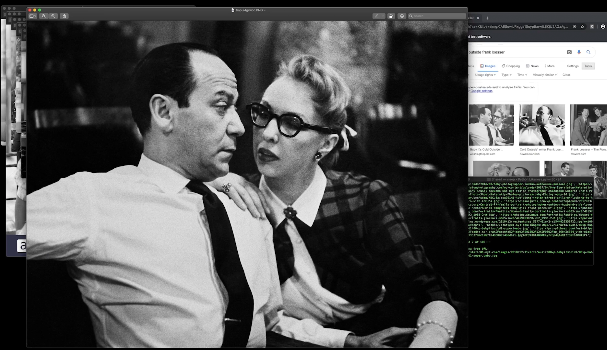

## Likeness

Built a Python Selenium bot for Thi My Lien Nguyen's art project. The bot does reverse image searches recursively - finds a similar image, then searches for that image, creating a chain of visual associations.

Started with one image, used reverse image search to find similar ones, then took the first result and searched again. Repeat until you have a chain of images connected by algorithmic similarity.

### Technical Implementation

Used Selenium to automate Google Images reverse search. Simple loop that captures results and feeds them back into the search.

The recursive nature creates unexpected visual journeys. What starts as a portrait might end up as abstract art through the algorithm's interpretation of similarity.
