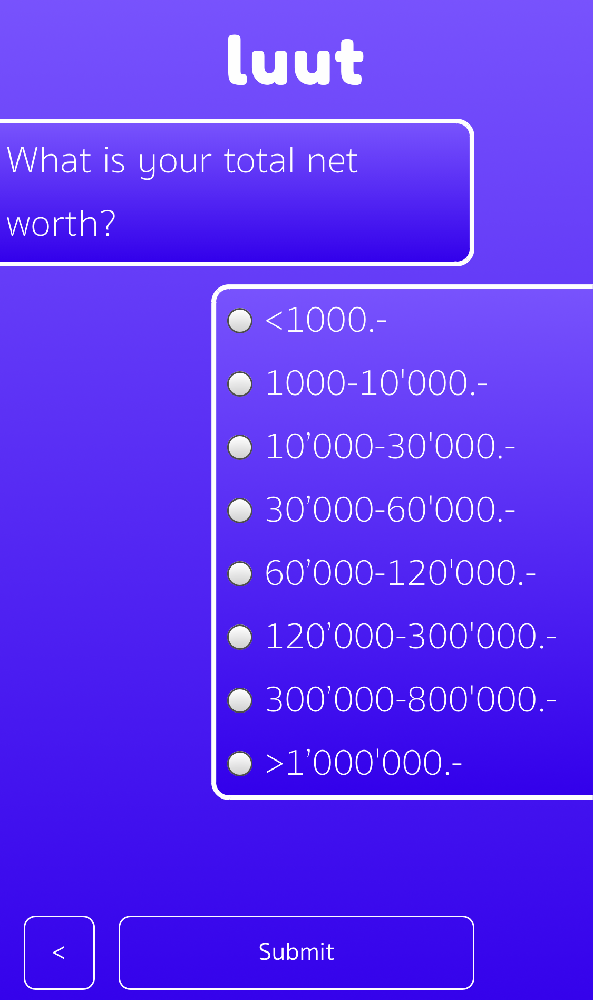
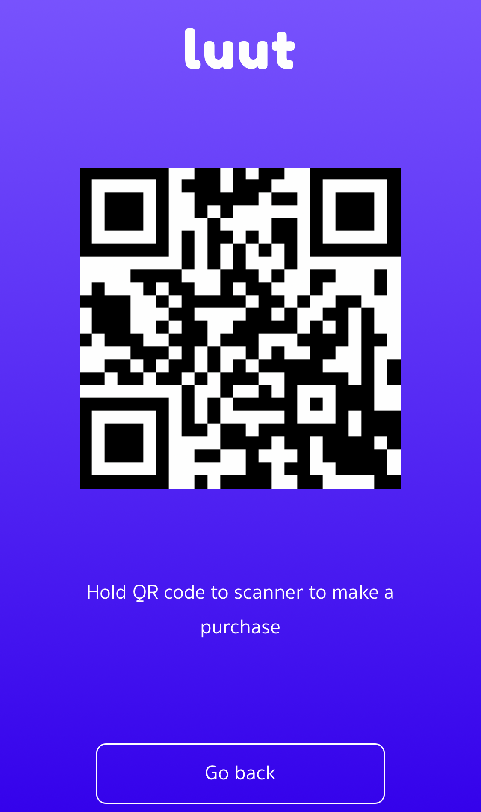
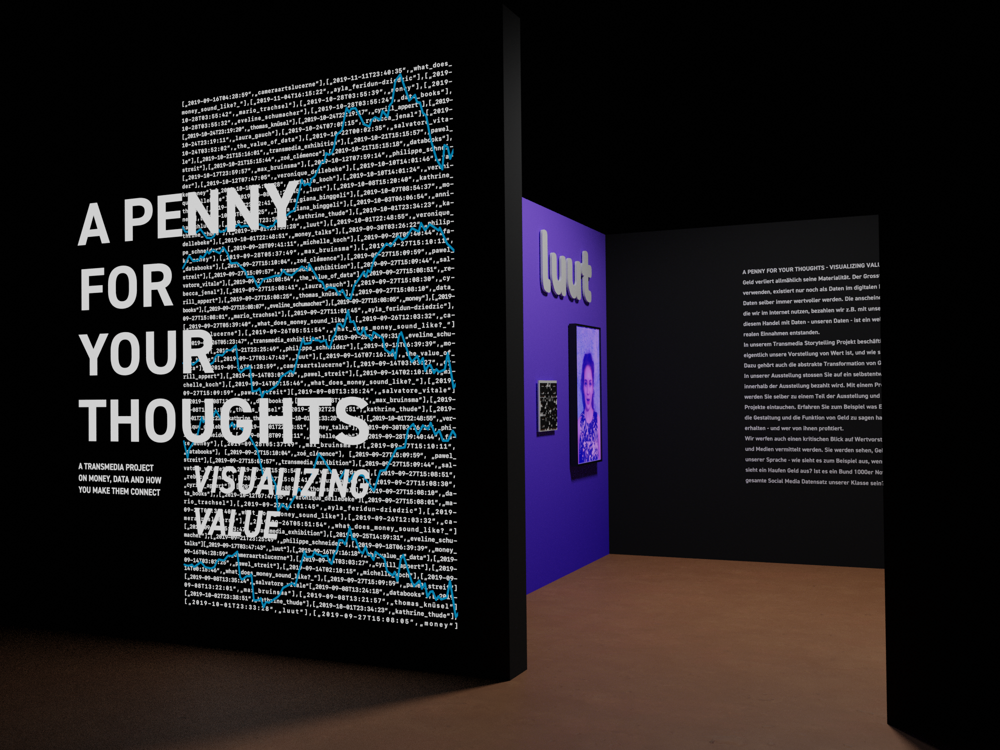
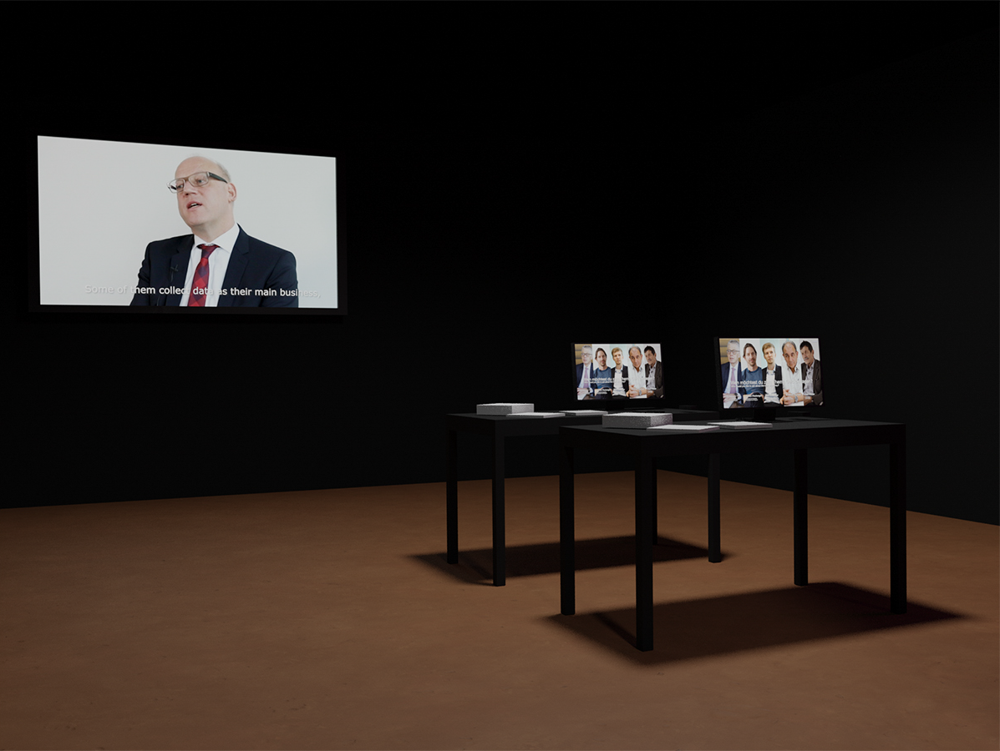
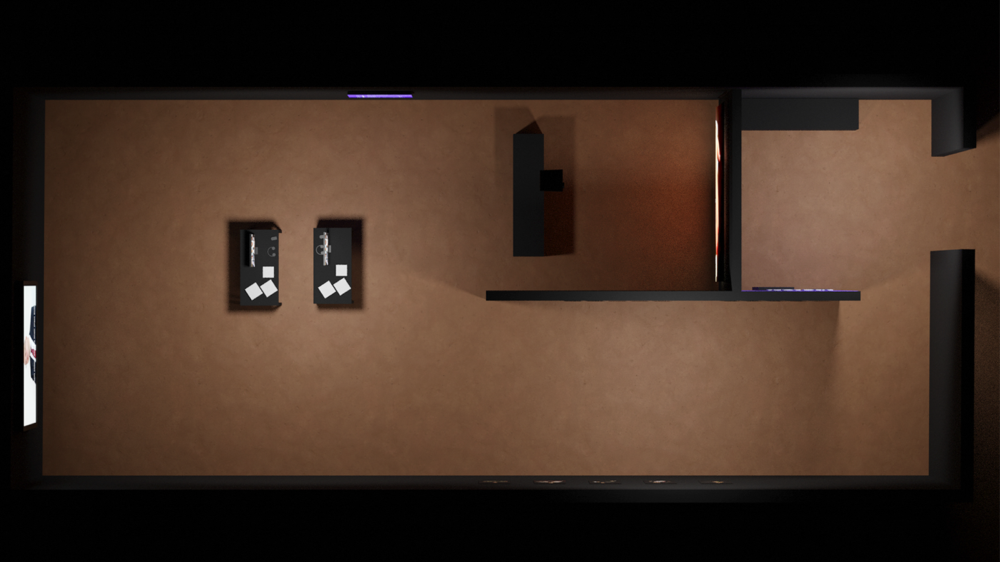

## Money

Transmedia project for 2nd year bachelor. Made an exhibition about the subject of money. Did photography, programmed an app, and created 3D visualizations of the exhibition space.

Combined different media to explore how money functions in society. Photography documented real-world interactions with currency, while the app provided interactive elements for visitors.

The 3D visualizations helped plan the physical exhibition layout. App integrated with the space to provide additional content layers.
