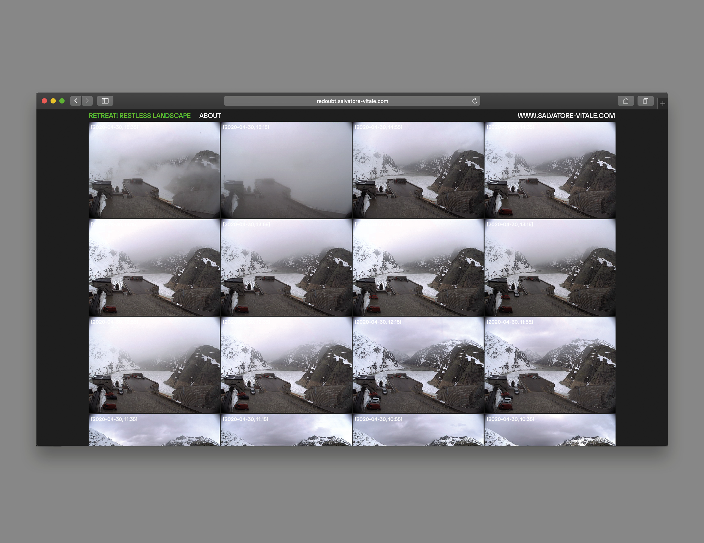
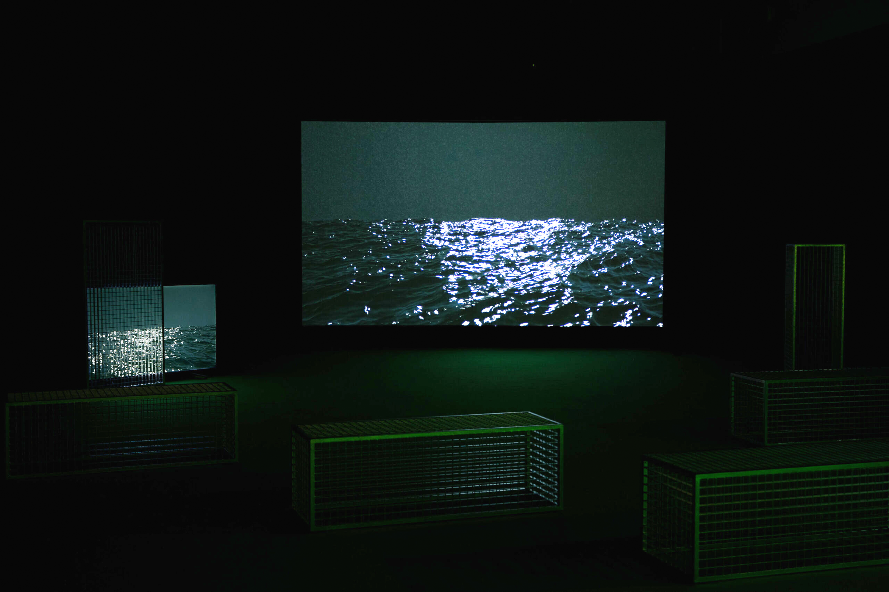

## Technical Work for Salvatore Vitale

Did technical support for two Salvatore Vitale projects. Built the web platform for "Retreat! Restless Landscape" and made a few Blender animations as well as some light control for "Decompressed Prism".

[Please check out Salvatore Vitale's work](https://www.salvatore-vitale.com/)

All images courtesy of Salvatore Vitale